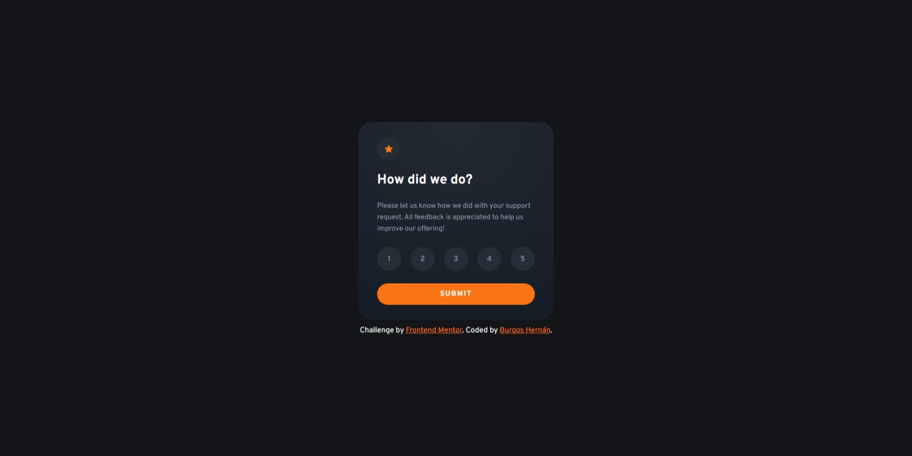

# Frontend Mentor - Interactive rating component solution



This is a solution to the [Interactive rating component challenge on Frontend Mentor](https://www.frontendmentor.io/challenges/interactive-rating-component-koxpeBUmI). Frontend Mentor challenges help you improve your coding skills by building realistic projects. 

## Table of contents

- [Overview](#overview)
  - [The challenge](#the-challenge)
  - [Screenshot](#screenshot)
  - [Links](#links)
- [My process](#my-process)
  - [Built with](#built-with)
  - [What I learned](#what-i-learned)
  - [Useful resources](#useful-resources)
- [Author](#author)

## Overview

### The challenge

Users should be able to:

- View the optimal layout for the app depending on their device's screen size
- See hover states for all interactive elements on the page
- Select and submit a number rating
- See the "Thank you" card state after submitting a rating

### Screenshot


### Links

- Solution URL: [Add solution URL here](https://github.com/burgosha/interactive-rating-component)
- Live Site URL: [Add live site URL here](https://bha-interactive-rating-component.netlify.app/)

## My process

### Built with

- Semantic HTML5 markup
- CSS custom properties
- Flexbox
- Mobile-first workflow
- [React](https://reactjs.org/) - JS library
- [Node.js](https://nodejs.org/)
- [Animate.css](https://animate.style/) - For animations


### What I learned

I learned by myself how to use hooks on rendered objects from a .map() method:

```js
<div className="rating-numbers animate__animated animate__bounceInRight">
                    {[...Array(5)].map((number, index) => {
                        index += 1;
                        return(
                            <button
                                type="button"
                                key={index}
                                className={index === rating ? "number-on" : "number"}
                                onClick={() => setRating(index)}
                            >
                                {index}
                            </button>
                        )
                    })}
</div>
```
Also, as you can see in the snipet above, I learned how to use the classes in the Animte.css package by reading its documentation.

### Useful resources

- [Animate.css](https://animate.style/) - Animate.css is a library of ready-to-use, cross-browser animations for use in your web projects.

## Author

- Frontend Mentor - [@burgosha](https://www.frontendmentor.io/profile/burgosha)
